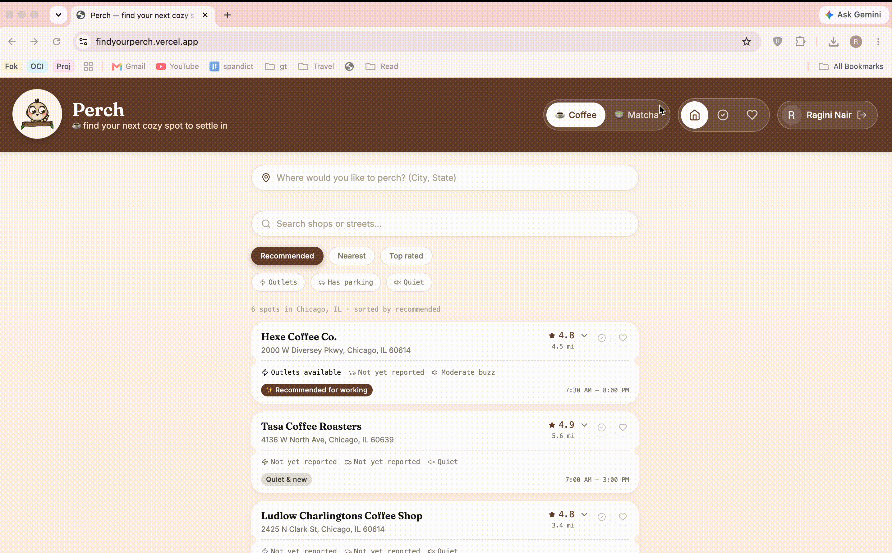
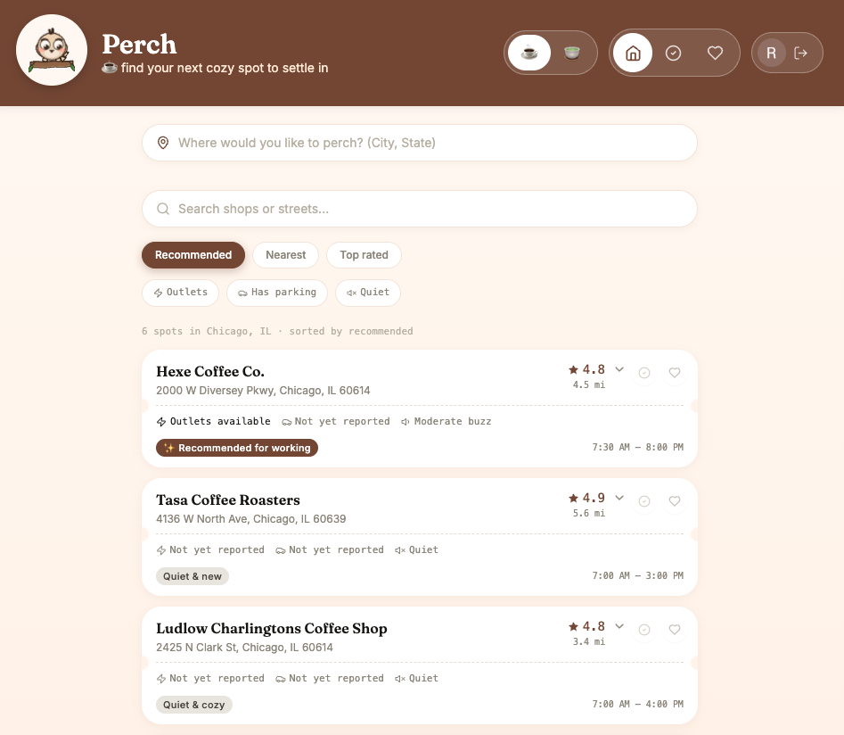
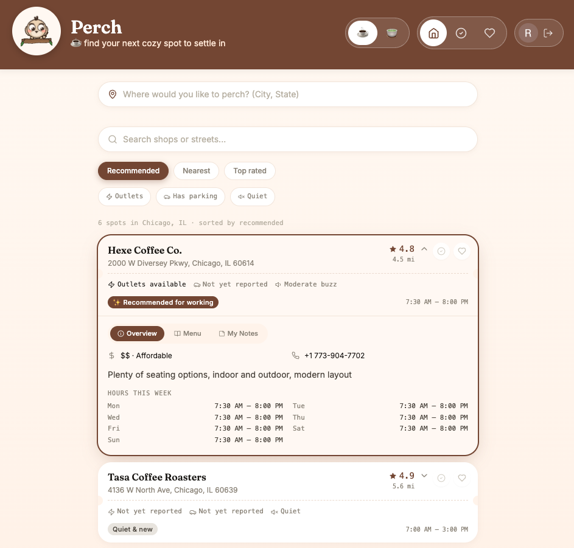

# Perch 🐦

**Find your next cozy spot to work from.**

Perch is a coffee-shop discovery app built for students and remote workers — the kind of app that answers "does this place have outlets and quiet seating?" instead of just "how's the coffee?"

**[Live demo →](https://findyourperch.vercel.app)** · Built solo, from first commit to production deploy.



Prefer matcha over coffee? Switch between themes to represent your mood!



Searching for coffee shops in Chicago, IL



Want to see more info on a specific cafe? Simply expand the card to find out!

---

## What it does

- **Real coffee shop data** for four cities (Norcross GA, Austin TX, Seattle WA, Chicago IL), plus **live nationwide search** for any other US city via the Google Places API
- **City autocomplete** that disambiguates same-named cities (typing "Rome" shows Rome, GA and Rome, NY as separate options, not a guess)
- **Work-readiness details** most map apps don't surface: outlets, parking type, and noise level — sourced from real review text via keyword analysis, not fabricated
- **Save & Visit tracking**, including a personal 1–5 star rating and free-text notes per visited spot
- **Google account sign-in** with Firestore cloud sync — your saved/visited list follows you across devices, with local-only fallback if you're not signed in
- **Two full visual themes** (coffee / matcha), each with its own accent color, background, and copy — switchable at runtime and remembered
- **Custom animated mascot** — a bird literally perched on a branch (a pun on the app's own name), with cursor-tracking eyes and a flapping-wing animation
- **Installable as a PWA** — add it to your home screen on iOS or Android and it opens like a native app

## Tech stack

- **React** + **Vite** — UI and build tooling
- **Google Places API** (Text Search, Autocomplete, Photos) — live shop data
- **Firebase** — Authentication (Google sign-in) and Firestore (cloud data sync)
- **Tailwind CSS** — styling
- **Vercel** — hosting, with automatic deploys on every push to `main`

## Key decisions

A few choices worth calling out, since they were deliberate tradeoffs, not defaults:

- **No fabricated data.** Outlet/parking/noise info is either pulled from real review text or explicitly marked "not yet reported" — a discovery app that guesses and gets it wrong is worse than one that's honest about gaps.
- **Local-first, cloud-optional.** The app is fully usable without an account (localStorage), and signing in layers cloud sync on top rather than gating core features behind auth.
- **One consistent mascot identity.** Early versions varied the mascot per theme; user testing (informal, but real) showed this diluted the character. Now one bird, two outfits.
- **Debounced cloud writes.** Personal notes sync to Firestore on a delay rather than per keystroke, to avoid excessive database writes on a free-tier project.

## What I'd do next

- Move the Google Places API key server-side (currently client-exposed, restricted by domain — fine for a personal project, not production-grade for scale)
- Expand curated city coverage beyond the current four
- Add photo uploads for community-contributed shop images

## Running it locally

```bash
npm install
npm run dev
```

See `.env.example` for the API keys needed to enable live search and account sync (the app runs in a reduced local-only mode without them).

---

*Built as a learning project — first time writing React, using Git, or deploying a live app. Genuinely shipped, bugs and all.*
